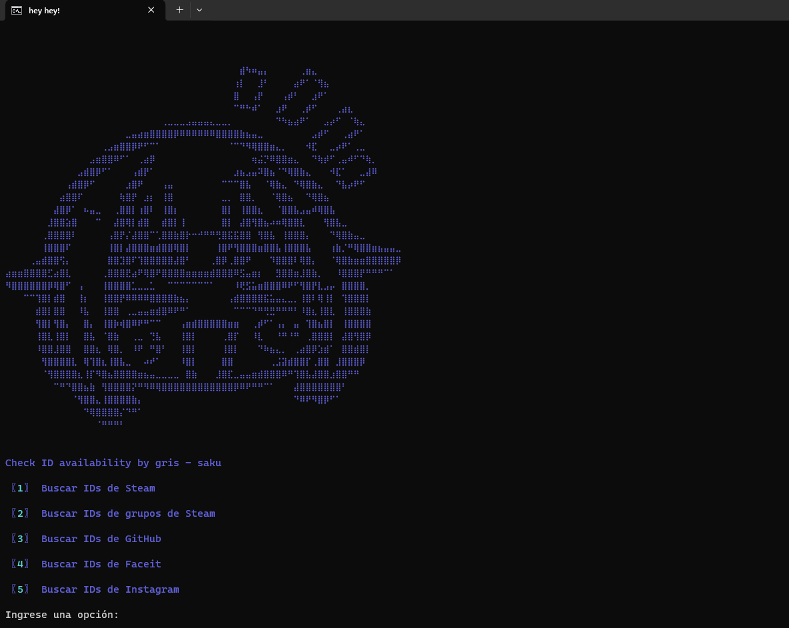

# Available Web Page IDs

- Available Web Page IDs es una herramienta diseñada para rastrear la disponibilidad de nombres de usuario (IDs) en plataformas como Steam , GitHub , Instagram y Twitter . Con esta herramienta, puedes verificar si un nombre de usuario está disponible o ya está en uso en estas plataformas.
  

## Características

### Compatibilidad con múltiples plataformas:

- Steam
- GitHub
- Instagram
- Twitter
  Fácil de usar : Simplemente manda una lista de nombres de usuario (.txt).

## Requisitos

- Python 3.8 o superior

## Instalación

1. Dependencias del proyecto:

   > pip install -r requirements.txt

2. Abre una terminal o línea de comandos (cmd).
   Navega hasta la carpeta donde se encuentra el archivo main.py:

3. Iniciar con:
   > py main.py

## Licencia

Este proyecto está bajo la licencia MIT . Consulta el archivo LICENSE para más detalles.

## Créditos

Desarrollado por [gris](https://github.com/yakknae) & [saku](https://github.com/ripsaku).
